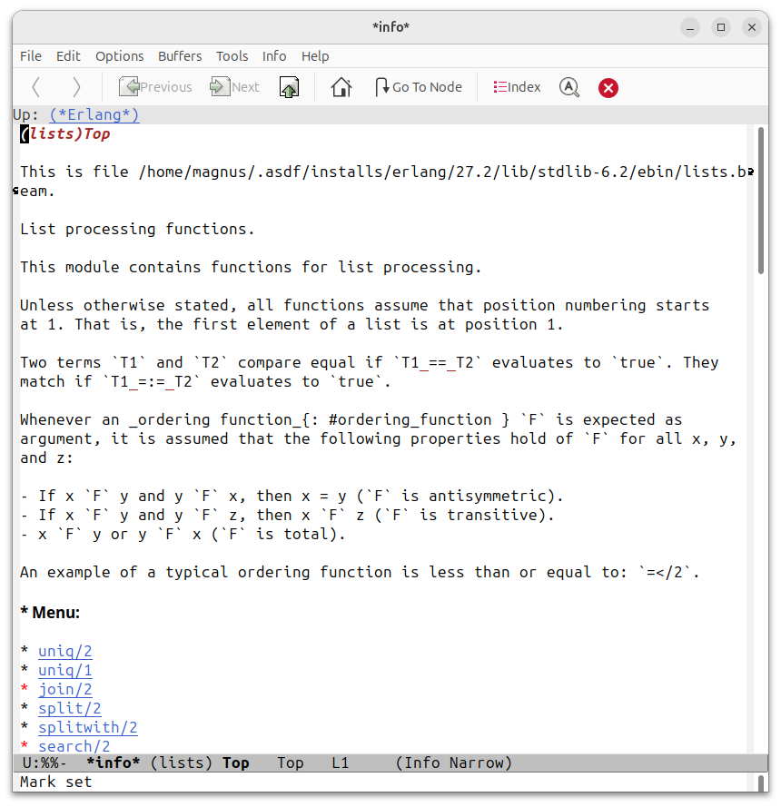

# erlang-info
Erlang/Elixir documentation browser for Emacs, based on Info.

To install it, clone this repository, and run `M-x package-install-file`
on `erlang-info.el`.

To use it, type `M-x erlang-info`, and type the name of the module
whose documentation you want to read.  It tries to be clever in order
to find the `.beam` file for the module, but if it can't it will
prompt for the location.  It relies on modules being compiled with
documentation as per [EEP 48](https://www.erlang.org/eeps/eep-0048.html).

See the comments in `erlang-info.el` for more details.

